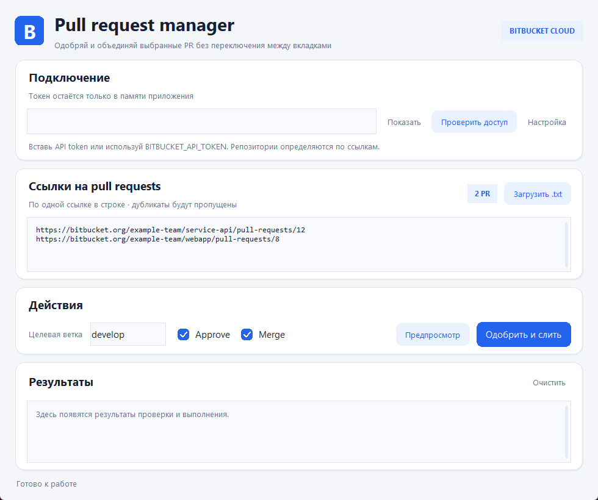

# Bitbucket PR Manager

Небольшое приложение для Bitbucket Cloud: вставь ссылки на PR, проверь план и отдельно выбери **Approve** и **Merge**. Merge выключен по умолчанию. Приложение последовательно обрабатывает только указанные ссылки и показывает ответ Bitbucket для каждого PR.



## Быстрый запуск

Готовые сборки для Windows, Linux, macOS Apple Silicon (`arm64`) и macOS Intel находятся в [Releases](https://github.com/Ikalike112/bitbucket-pr-manager/releases) приватного репозитория. Скачай архив для своей ОС и запусти приложение. Сборки создаёт [GitHub Actions](.github/workflows/build-desktop.yml) из исходников этого репозитория. Они не подписаны сертификатом разработчика: на macOS может потребоваться открыть приложение через контекстное меню **Open**; глобально отключать Gatekeeper не нужно. Если сборок ещё нет, используй запуск из исходников ниже.

Для запуска из исходников нужны Python 3.10+ и Tkinter. Python-пакеты через `pip` для приложения не требуются.

| ОС | Установка Python и Tkinter | Запуск из исходников |
| --- | --- | --- |
| Windows | Установи [Python 3](https://www.python.org/downloads/windows/) с опцией **tcl/tk and IDLE** (обычно включена). | Дважды щёлкни `run-windows.cmd` или выполни `py -3 app/bitbucket_pr_ui.py`. |
| macOS | Установи [Python 3](https://www.python.org/downloads/macos/) с Tkinter. Проверь `python3 -m tkinter`. | Дважды щёлкни `run-macos.command` или выполни `python3 app/bitbucket_pr_ui.py`. После загрузки архива может понадобиться `chmod +x run-macos.command`. |
| Linux | Установи `python3` и Tkinter (команды ниже). | Выполни `./run-linux.sh` или `python3 app/bitbucket_pr_ui.py`. |

Установка Tkinter на Linux:

```bash
# Ubuntu / Debian
sudo apt update && sudo apt install python3 python3-tk

# Fedora
sudo dnf install python3 python3-tkinter

# Arch Linux
sudo pacman -S python tk
```

Если `./run-linux.sh` после скачивания архива не запускается, выполни `chmod +x run-linux.sh`. Проверить наличие Tkinter можно командой `python3 -m tkinter` — откроется небольшое тестовое окно.

## Доступ к Bitbucket

Создай [Bitbucket Cloud API token](https://support.atlassian.com/bitbucket-cloud/docs/create-an-api-token/) для аккаунта с доступом к нужным репозиториям. Токену требуются права определить пользователя, читать PR и выполнять approve/merge. Вставь его в скрытое поле **API token** и нажми **Проверить доступ**. Можно также задать переменную окружения `BITBUCKET_API_TOKEN` до запуска.

Токен не сохраняется в файл и не попадает в журнал приложения. Ссылки и действия также не сохраняются. Не добавляй токен в исходники, командную строку, PR-файлы или Git. Собственное одобрение автора PR может не удовлетворить правилу обязательного ревьюера; приложение не обходит merge checks Bitbucket.

## Как пользоваться

1. Вставь полные ссылки вида `https://bitbucket.org/workspace/repository/pull-requests/123`, по одной в строке, или загрузи `.txt` файл. Пустые строки, строки с `#` и дубли пропускаются.
2. Проверь **Целевую ветку**. По умолчанию это `develop`; PR в другую ветку приложение отклонит. Пустое поле допускает любую ветку.
3. Выбери **Approve**, **Merge** или оба флажка. Когда выбраны оба, приложение сначала одобряет PR, затем пытается его слить. **Предпросмотр** не меняет PR.
4. Нажми синюю кнопку для выполнения. Уже слитые PR пропускаются. Ошибка одного PR не останавливает следующую ссылку.

Зависимые PR запускай отдельными пачками и в порядке зависимостей. Скрипт не определяет зависимости между репозиториями автоматически.

## Для разработчиков

CLI с тем же Bitbucket API-кодом: `python app/bitbucket_pr_batch.py --help`. Проверка без изменений: `python app/bitbucket_pr_batch.py --dry-run --target develop https://bitbucket.org/workspace/repository/pull-requests/123`.

Тесты:

```bash
python -m unittest discover -s tests -p "test_*.py"
```

Сборки исполняемых файлов запускаются вручную в **Actions → Build desktop apps → Run workflow**. Тег вида `vX.Y.Z` запускает четыре сборки и добавляет архивы в приватный GitHub Release. Для локальной сборки требуется только `python -m pip install -r requirements-build.txt`, затем `python -m PyInstaller --onefile --windowed --name BitbucketPRManager app/bitbucket_pr_ui.py`.
